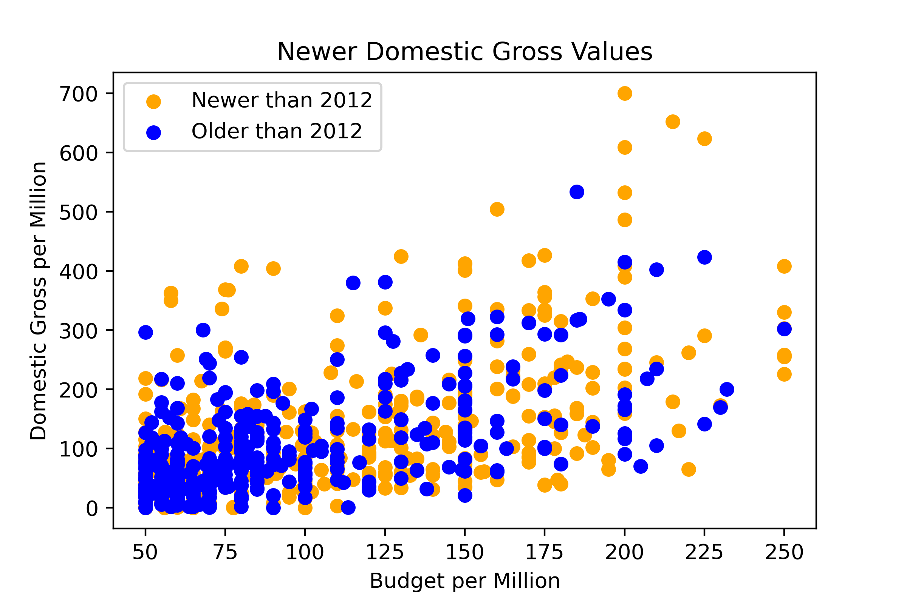
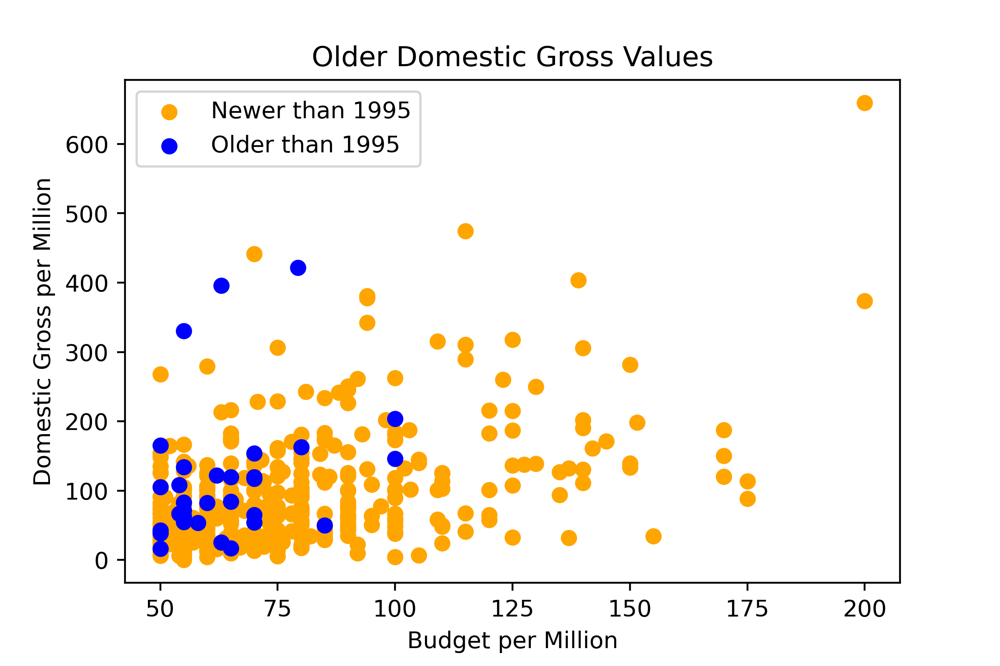
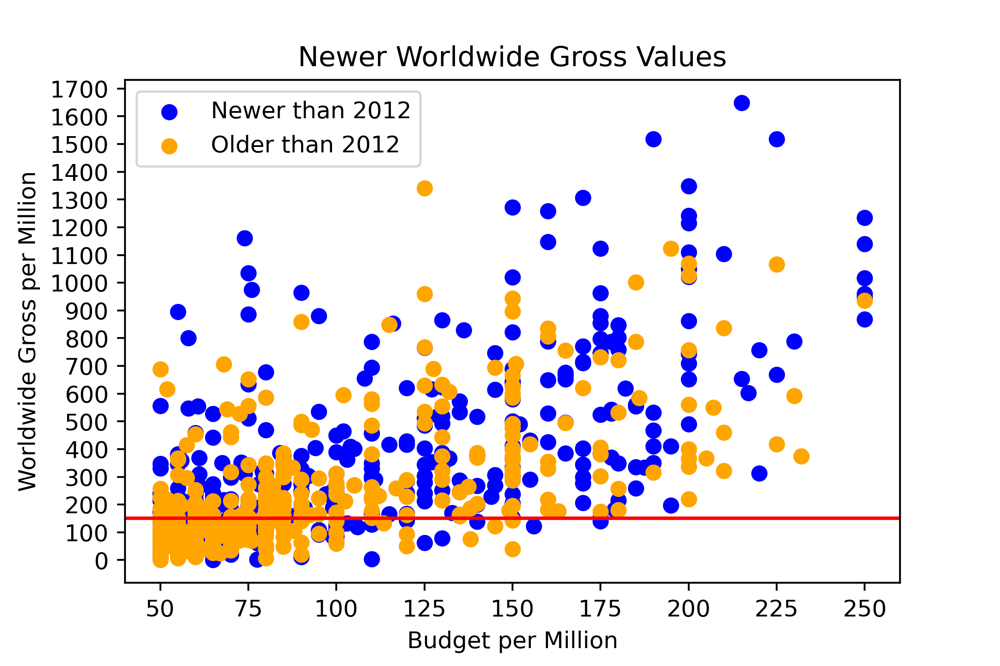
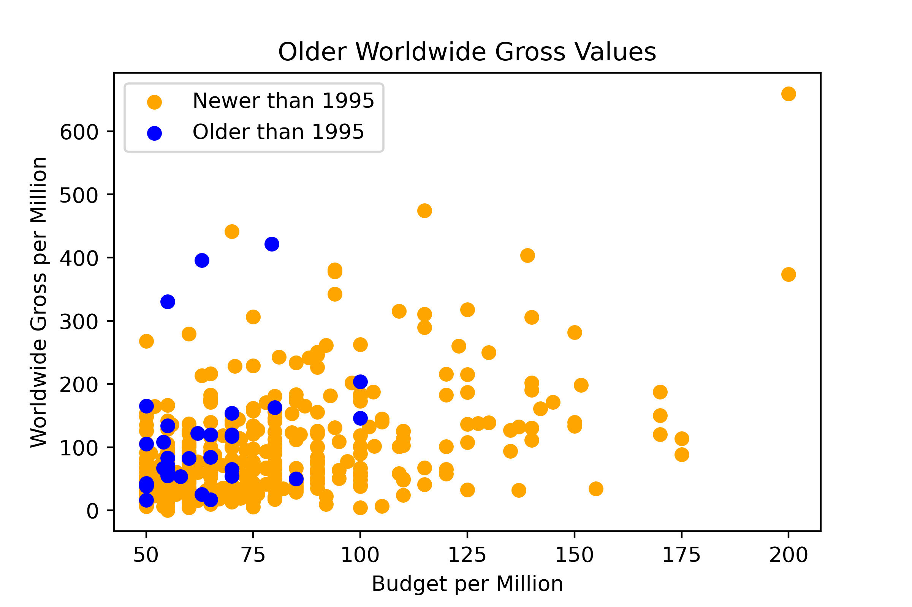
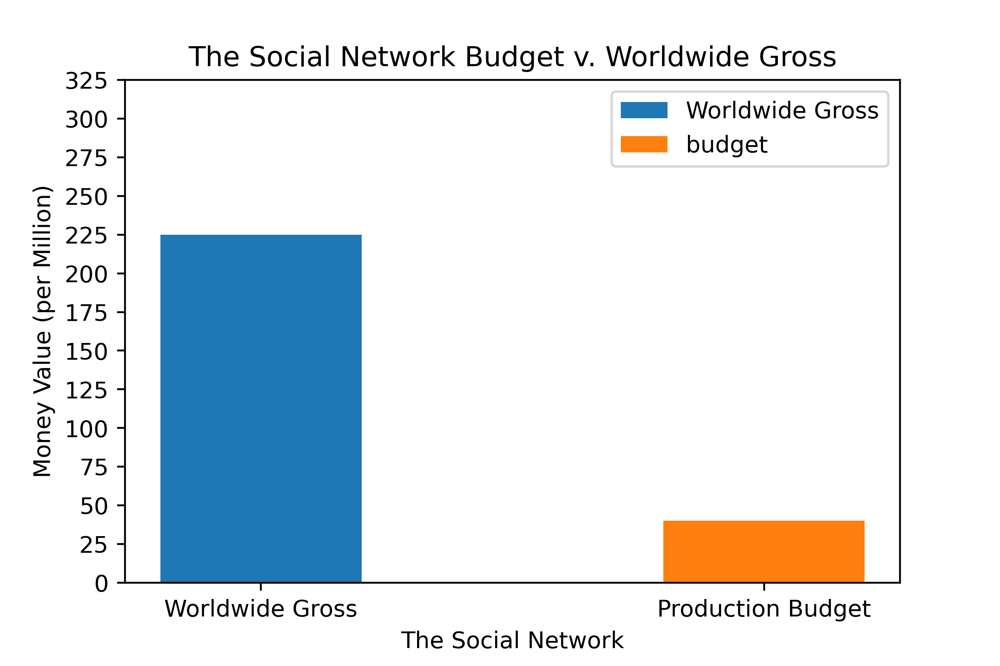
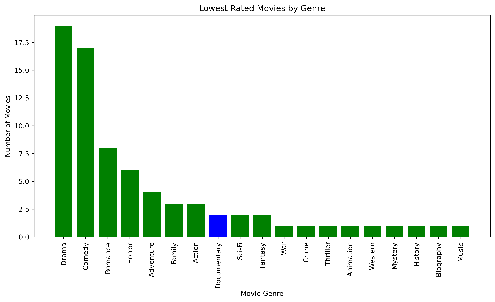

# Microsoft Movie Studios Recommendations

## Project Overview

This project analyzes movie data from movie aggregation websites to create proposals for a hypothetical new Microsoft Movie Studios. The analysis shows that movies which met a budget threshold or released during peak months typically yielded greater profits. Additionally, documentaries were the top-rated genre. Microsoft can leverage these three business insights for producing successful movies.

## Business Understanding

Our client is a hypothetical new Microsoft Movie Studios. The goal of our analysis is to provide suggestions to help Microsoft decide what kind of movies to produce. We conducted an analysis on movie data to construct three actionable insights that Microsoft can utilize to find success in their movie-making venture.

## Data Understanding and Analysis

Our data is stored in a folder named zippedData. The data is sourced from a variety of movie aggregation sites: Box Office Mojo, IMDB, Rotten Tomatoes, TheMovieDB, and The Numbers. 

The budgets/gross data encompasses a wide range of years. To hone in on more recent market trends, we limited the release window to the last 25 years. This also reduces the effect of inflation on our analysis. While we are starting to see how gross might relate to release month, we can deepen our analysis by relating gross to the production budget. Dividing the difference of 'worldwide_gross' and 'production_budget' by the 'production_budget' created a Return of Investment (ROI) measure. 

Data gathered from IMDB included movie genres, average ratings, and the number of votes received. The data was joined to view all relevant data on one table. We utilized the median number of votes received (49) as a way to eliminate movies with so few votes that might mean they were not seen by many viewers. I decided to look at the top 50 and bottom 50 rated films to see which genres were most represented in the highest and lowest rated films. We plotted the movie counts for the 50 top rated movies to show that Documentary was the genre with the highest movie count. We also plotted the movie counts for the 50 lowest reated movies to show that Documentaries were not as common in the lowest rated movies.

## Data Visualization

Using the tmdb data, we plotted the popularity score against month to see if any month had more popular movies overall.

December movies had the highest average popularity score with June's and July's as almost identical runner-ups.

Another aspect to consider for a movie's release month is the quantity of movies released during that month. This can provide some insight into how popular certain months are and how much competition a movie might have during its release.

Again, December stands out with the greatest number of movie releases. The other 6 months with the most releases are October, September, August, April, and March.

The following stacked bar chart takes our budget/gross dataset and plots the mean gross values grouped by month. A month with a greater mean/median movie gross could indicate more consumers are watching movies during that time.

Graphing the same data limited to movies released in the past 25 years revealed similar trends. We focused on the last 25 years to better reflect modern market trends and reduce the effect of inflation.

The similarity between the mean and median charts indicates that these measures are weighted heavily by releases from the past 25 years. May had the strongest performing movies, followed closely by June, July, and November. December lagged behind the front-runner months but still stood significantly above the remaining months.

We also graphed the median movie gross grouped by month. Using the median reduces the effect of super-performer movies such as "Avatar". This can give us a better look at how an "average" movie might perform in a given release window.

May was the most strongly affected by using the median instead of the mean. This indicates that May had some outlier movies with high gross. The median could be a better metric for a fledgling movie studio. 

Now that we've looked at trends in gross data, we added in budget as another variable for consideration. Return on investment (ROI) here was calculated as the difference between gross and budget, divided by the budget. This provided a ratio of movie profits versus movie costs. Similarly to the gross plots, the mean and median ROI for movies grouped by release month were plotted.

July stands out above the rest with a mean ROI of 5.07. The month with the second greatest mean ROI is May at 3.68. After plotting the median ROI of movies against their release month, we saw how ROI is greatly affected by overperformers.

June, July, November, and December also had high mean gross, a trend reflected by the median gross as well. Based on this analysis, we could say that movies releasing in these 4 months generally experienced the best gross performance. 

The greatest median ROI of movies based on month was 1.18, lower than any value of the mean ROIs. The difference between the means and medians reflects how uncertain the movie market is. Movies that excel can return great profits but are not the norm. Only three months had median ROIs that surpassed the break-even ratio of 1.0.  Here we see the best performing months match those highlighted in our median gross by month analysis. June, July, November, and December return as the best performers.

After our analysis of movies based on their release months, we concluded that there are clear months in which movies displayed better financial performance.

We wanted to show the relationship between new domestic gross and production budgets. To do that we first formatted the data
so that the x and y scales werent based off exponenents by running a formatter and changing the x and y ticks to be more
accurate to the data being shown. Then we plotted a scatter plot with the x value being budget and y value being gross.
We added a third element to the scatter plot to further seperate the data, movies that were newer than 2012 were colored
orange and anything before was colored blue. The domestic values wont be presented because they dont get our point across as well as worldwide gross.

We wanted to show the same concept as the above graph except this is working with older movies, and the color seperation is before and after 1995.

Similar to the above graphs but we are now working with worldwide gross instead of domestic gross. For the next two graphs, which we will be focusing my presentation about, we made a line to show the fact that many movies past the 150 million budget mark far make more profit than budget so their ROI is much more profitable the more they spend.

For the next two lines of code we wanted to show examples that could be good starting points for Microsoft if they did want to a documentary style films, while not necessarily full documentarys these two films are dramatizations of documentary biographies and could be relevant if Microsoft wanted to do a similar style for a documentary about Bill Gates or tech culture.

In order to achieve this comparison i first made the variable The Social Network.
After setting the x variable i assigned a stacked bar chart for each and used the seperated variables within the data for each statistic i was looking at within the movie to show a clean bar chart which illustrated the budget and worldwide gross for the movie. A legend to show what each color represents helps differentiate.

To visualize the highest rated films by genre, we plotted the movie counts for the 50 top rated movies to show that Documentary was the genre with the highest movie count. We also plotted the movie countws for the 50 lowest reated movies to show that Documentaries were not as common in the lowest rated movies.

## Conclusion

We developed three recommendations from our analysis for Microsoft Movie Studios:
- **Release films in peak months:** Microsoft Movie Studios should consider releasing movies in June, July, November, and December to optimize movie profits.
- **Allocate a budget of 150 to 200 million dollars:** Since movies with a budget over 150 million dollars displayed a greater return-on-investment, Microsoft Movie Studios should invest within the recommended budget range.
- **Focus on documentaries:** Our analysis found that the documentary genre has the most top rated movies. Microsoft Movie Studios should prioritize documentaries as a safe choice for movie genre.

## Next Steps

Here are other ideas to explore for future analysis:

- **Streaming Platforms vs Movie Theaters:** Streaming services are becoming increasingly popular. Further analysis can focus specifically on movies released through streaming services.
- **Investigate success of film adaptations:** Microsoft has many properties that could be adapted to movies. Analysis on adaptation success could help Microsoft leverage those properties.
