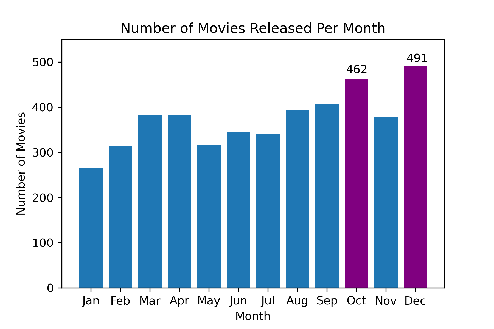
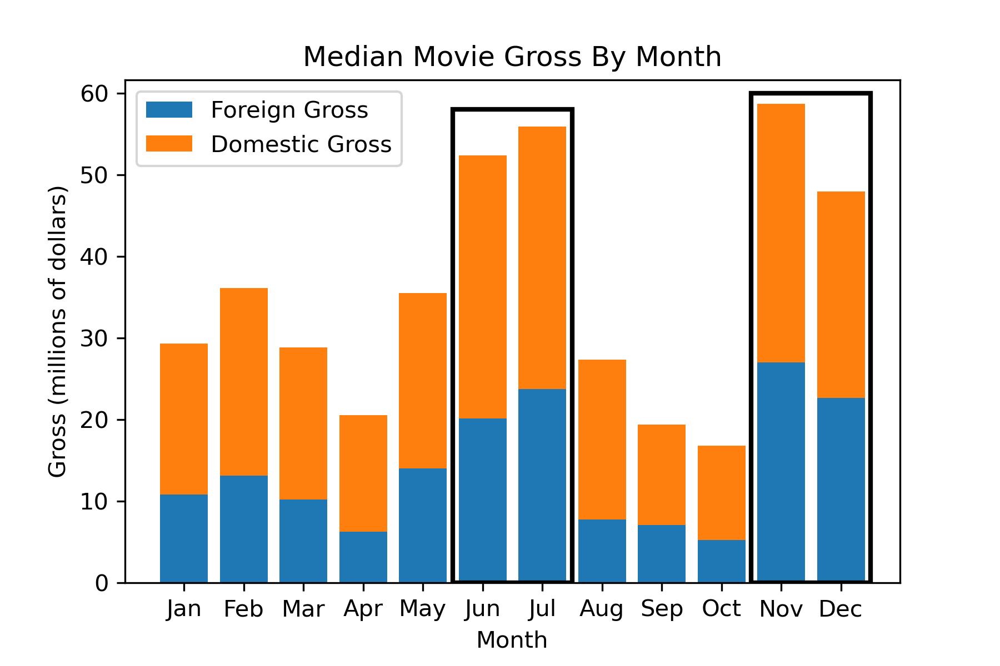

# Microsoft Movie Studios Recommendations

## Project Overview

This project analyzes movie data from movie aggregation websites to create proposals for a hypothetical new Microsoft Movie Studios. The analysis shows that movies which met a budget threshold or released during peak months typically yielded greater profits. Additionally, documentaries were the top-rated genre. Microsoft can leverage these three business insights for producing successful movies.

## Business Understanding

Our client is a hypothetical new Microsoft Movie Studios. The goal of our analysis is to provide suggestions to help Microsoft decide what kind of movies to produce. We conducted an analysis on movie data to construct three actionable insights that Microsoft can utilize to find success in their movie-making venture.

## Data Understanding and Analysis

Our data is stored in a folder named zippedData. The data is sourced from a variety of movie aggregation sites: IMDB, Box Office Mojo, Rotten Tomatoes, TheMovieDB, and The Numbers. 

Data gathered from IMDB included movie genres, average ratings, and the number of votes received. The data was joined to view all relevant data on one table. 

The data we analyzed from the other sources includes budgets, domestic/worldwide gross, and release date.

## Results

This bar graph shows the quantity of movies released during that month from data covering 1997 to 2019. December stands out with the greatest number of movie releases, followed by October.



Four notable months stand out as having the highest gross per movie: June, July, November, and December.



After looking at trends in gross data, we added in budget as another variable. Return on investment (ROI) was calculated as the difference between gross and budget, divided by the budget. This provided a ratio of movie profits versus movie costs.

Only three months had median ROIs that surpassed the break-even ratio of 1.0.  We found the best performing months match those highlighted in our median gross by month analysis. June, July, November, and December return as the best performers.

After our analysis of movies based on their release months, we concluded that there are clear months in which movies displayed better financial performance.


We wanted to analyze the relationship between worldwide gross and production budgets. The color separation distinguishes between newer and older movies, to reflect how return on investment trends changes between newer and older movies.

The first graph covers movies in our datasets released before 2005. The second graph covers movies in our datasets released after 2005. No trend is apparent in the pre-2005 graph, while the post-2005 graph displays an upward trend in return on investment.
In these graphs, a line indicates the 150 million dollar budget mark. Past this threshold, most movies have positive return on investment. 


As a particular example, we looked at "The Social Network" as a dramatized documentary-style movie that Microsoft could use as a case-study. The bar chart below shows the wordlwide gross and budget for the film. 


To visualize the highest rated films by genre, we plotted the movie counts for the 50 top rated movies to show that Documentary was the genre with the highest movie count. We also plotted the movie counts for the 50 lowest rated movies to show that Documentaries were not as common in the lowest rated movies.


## Conclusion

We developed three recommendations from our analysis for Microsoft Movie Studios:
- **Release films in peak months:** Microsoft Movie Studios should consider releasing movies in June, July, November, and December to optimize movie profits.
- **Allocate a budget of 150 to 200 million dollars:** Since movies with a budget over 150 million dollars displayed a greater return-on-investment, Microsoft Movie Studios should invest within the recommended budget range.
- **Focus on documentaries:** Our analysis found that the documentary genre has the most top rated movies. Microsoft Movie Studios should prioritize documentaries as a safe choice for movie genre.

## Next Steps

Here are other ideas to explore for future analysis:

- **Streaming Platforms vs Movie Theaters:** Streaming services are becoming increasingly popular. Further analysis can focus specifically on movies released through streaming services.
- **Investigate success of film adaptations:** Microsoft has many properties that could be adapted to movies. Analysis on adaptation success could help Microsoft leverage those properties.

## Presentation Link
Link to presentation: 

## Repository Structure
```
├── Working_Notebooks
│   ├── John_Notebook.ipynb
│   ├── working_notebook_Yuhkai.ipynb
├── visualizations
│   ├── Tech_movies.png
│   ├── highest_genre_graph.png
│   ├── lowest_genre_graph.png
│   ├── median_ROI_month.png
│   ├── median_movie_gross_month.png
│   ├── median_movie_gross_month_recent.png
│   ├── movie_data_erd.jpeg
│   ├── movies_per_month.png
│   ├── new_domestic.png
│   ├── new_worldwide.png
│   ├── old_domestic.png
│   └── old_worldwide.png
├── zippedData
│   ├── bom.movie_gross.csv.gz
│   ├── im.db.zip
│   ├── rt.movie_info.tsv.gz
│   ├── rt.reviews.tsv.gz
│   ├── tmdb.movies.csv.gz
│   └── tn.movie_budgets.csv.gz
├── .canvas
├── .gitignore
├── CONTRIBUTING.md
├── LICENSE.md
├── README.md
├── notebook.pdf
├── presentation.pdf
└── student.ipynb
```
